<!-- 👋 Приветствие -->
<div align="center">
  
  <h1>Привет, я <span style="color:#FF69B4;">Jinwoo</span> </h1>
  <h3>✨ Java разработчик модов Minecraft | ☕ Java-инженер | 💬 Discord Dev</h3>
</div>

---

## 🛠 Обо мне
```diff
+ 🧠 Пишу моды с 1.7.10 по 1.20.1 FORGE | FABRIC — от идеи до реализации
+ 📦 Продаю и кастомизирую готовые модификации
+ 💡 Java DISCORD боты с кастомной логикой
! 🕒 Работаю быстро, по ТЗ и без — стоимость зависит
```

---

## 🚀 Услуги
- 🔧 Разработка Minecraft модов FORGE | FABRIC (1.7.10 - 1.20.1)
- 🧩 Продажа и доработка готовых модов (самопис)
- 🤖 Разработка Java Discord ботов
- 🔨 Установка серверов (1.7.10 - 1.20.1) + настройка плагинов

💳 Оплата через Крипту

---

## 🖼️ Портфолио

### ⚔️ [Render/Клиент] CustomSword (1.7.10)

Высокодетализированная 3D-модель клинка с глубокой проработкой каждого элемента.

(Модель сделана на заказ другим человеком)

**Скриншоты:** 

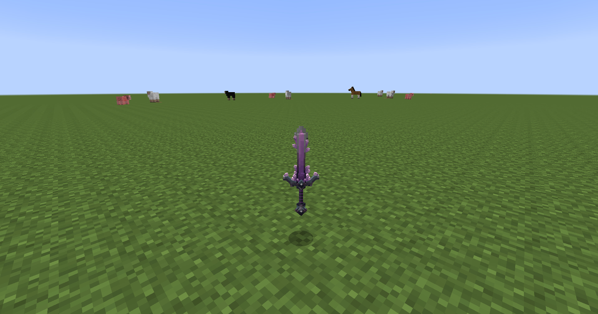  
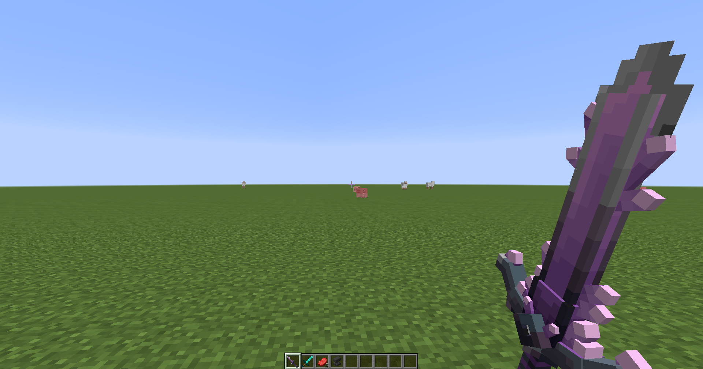  
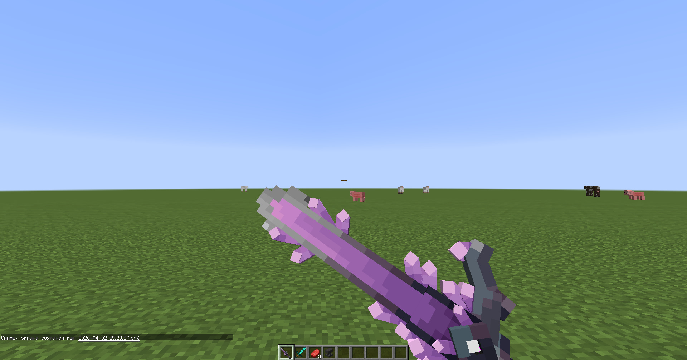  
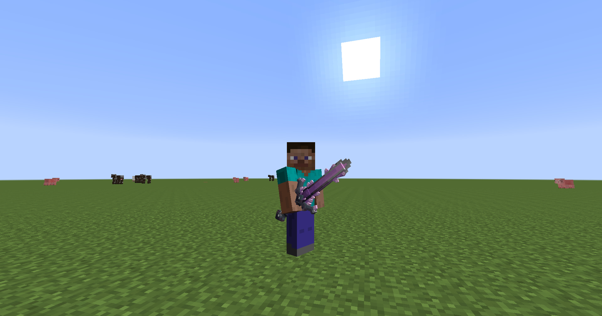  

---

### ⚔️ [GUI/Клиент-Сервер] DivineCapture (1.7.10)

Интерактивная система захвата контрольных точек с наглядной визуализацией зоны и удобным прогресс-баром на экране. 
Идеальная механика для стимуляции PvP-активности и клановых войн, награждающая игроков ценным лутом за удержание стратегических позиций.

**Видео:** 

https://youtu.be/7RUSbf1nyMQ

---

### 📩 [GUI/Клиент] TabMod (1.7.10)  
Измененное отображение информации об количестве игроков на сервере.

**Скриншот:**  

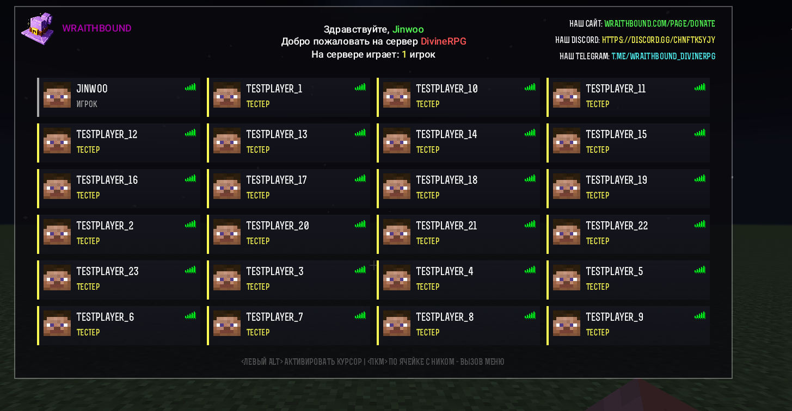  

---

### ⚔️ [Animation/Клиент] HitStats (1.7.10)  
Динамичное визуальное отображение нанесенного урона и регенерации здоровья над игроками и мобами. 
Незаменимая механика для PvP и PvE сражений, позволяющая точно контролировать ход боя.  

**Видео:**  


---

### 🎮 [GUI/Сервер] AuctionMod (1.7.10)  
Система аукциона со своей валютой и кастомными уведомлениями.  

**Скриншоты:**  

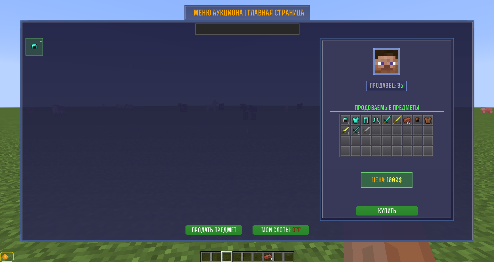  
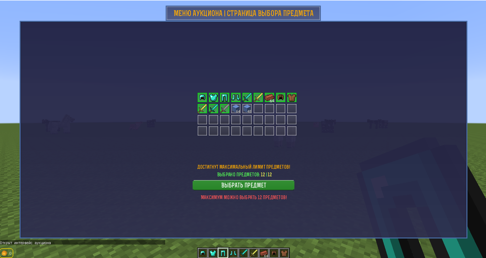
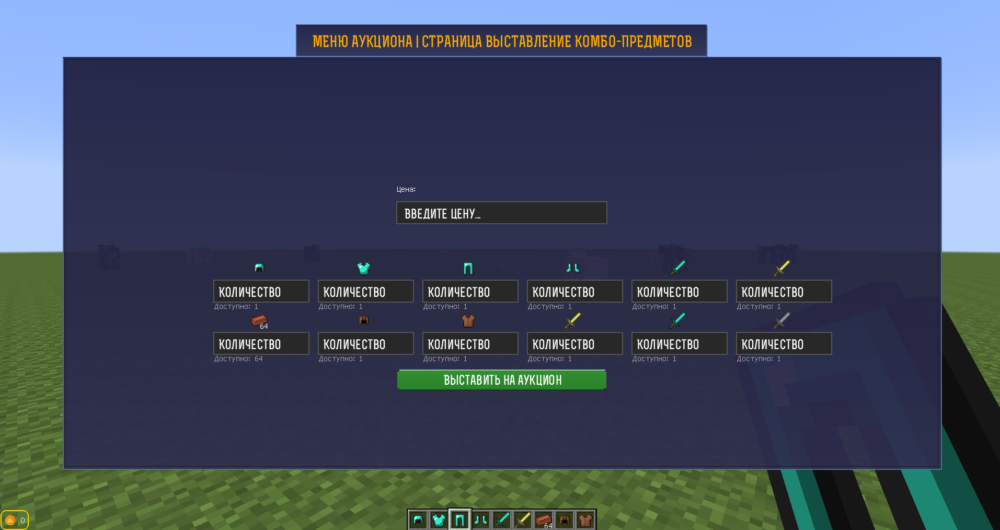
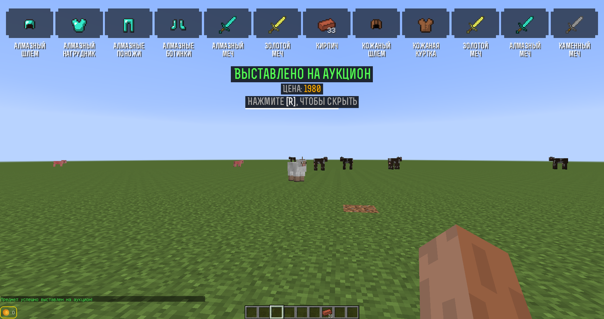

---

### ⚙️ [GUI/Клиент] CustomMainMenu (1.7.10) 
Измененное главное меню и выбор сервера.  

**Скриншоты:**  
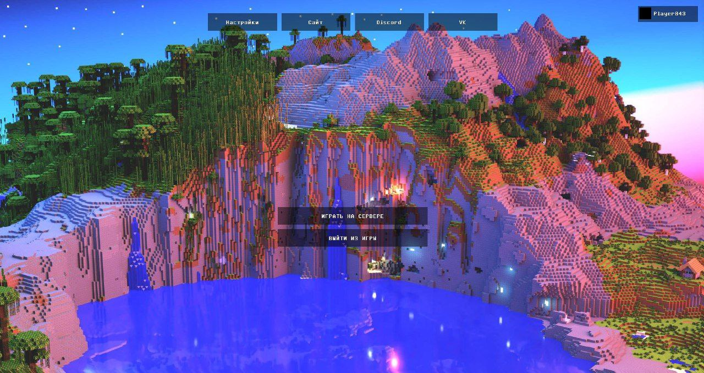  


---

### ⚙️ [GUI/Клиент-Сервер] TradeMod (1.7.10)  
Механика внутриигрового обмена с интегрированным чатом и системой кастомной валюты.  

**Скриншоты:**  

  


---

### ⚙️ [GUI/Клиент] LoadingScreen (1.7.10)  
Измененный экран загрузки.  

**Скриншоты:**  

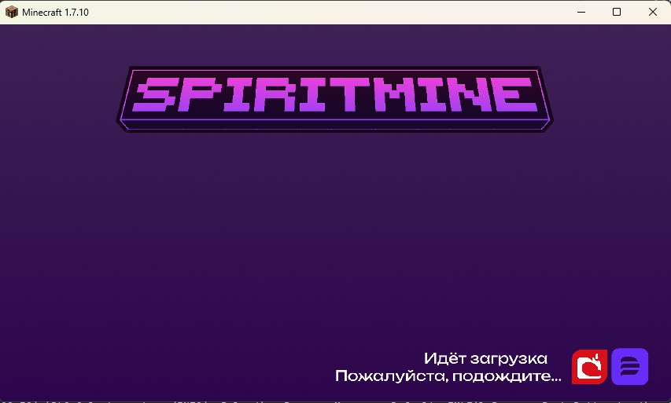  

---

### ⚙️ [GUI/Клиент-Сервер] ClanSystem (1.7.10)  
Клановая система с гибким управлением PvP-режимом для участников клана и внутренней экономикой на кастомной валюте.
Поддерживается подключения к базе данных MySQL.

**Скриншоты:**  

  
  
  
  
  
  
  
  

---

### ⚙️ [Animation/Клиент] ItemHoverInfo (1.7.10)  
Отображение информации о предмете лежащем на земле.

**Скриншоты:**  

  

---

### 📩 [GUI/Клиент] TabMod (1.7.10)  
Измененное отображение информации об количестве игроков.

**Скриншоты:**  
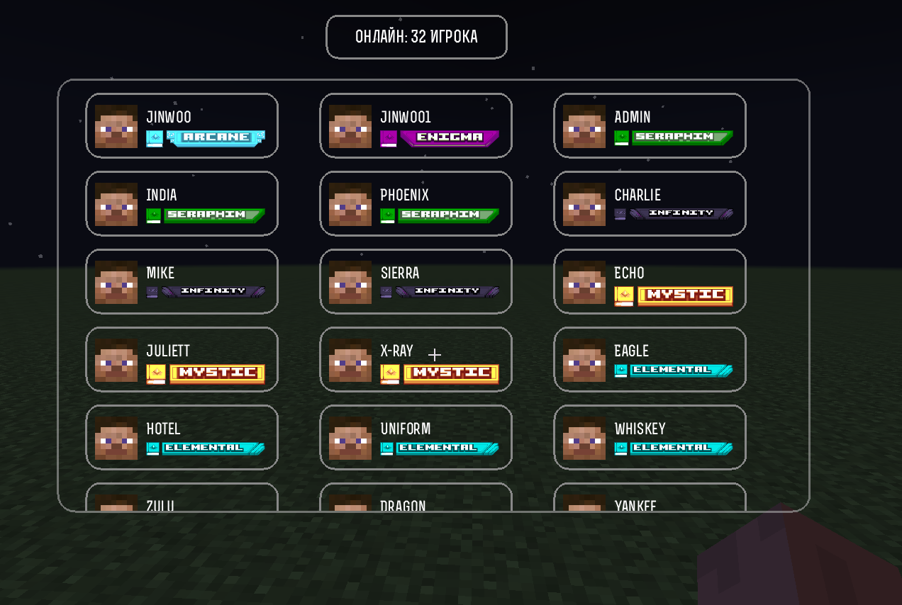  
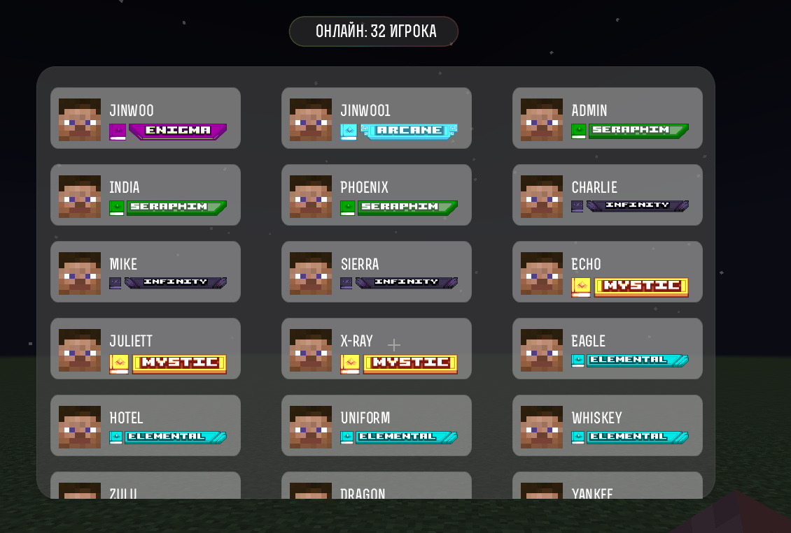
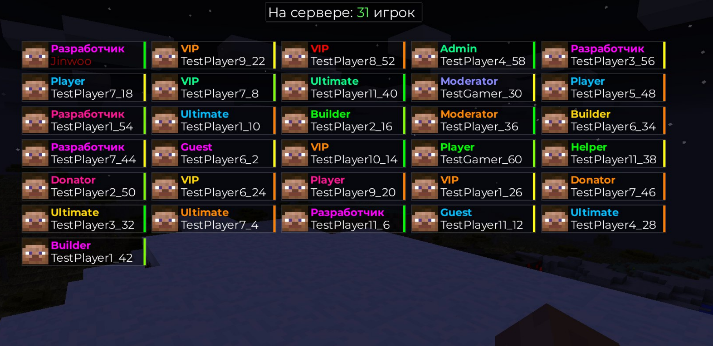
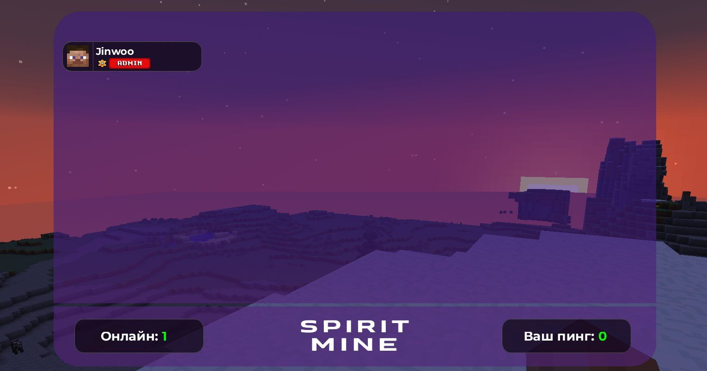

---

### ⚙️ [GUI/Клиент-Сервер] Аукцион/Маркет (1.7.10)  
Механика внутриигрового аукциона/маркета среди игроков и внутренней экономикой на кастомной валюте.
Поддерживается подключения к базе данных MySQL.  
**Скриншоты:**  
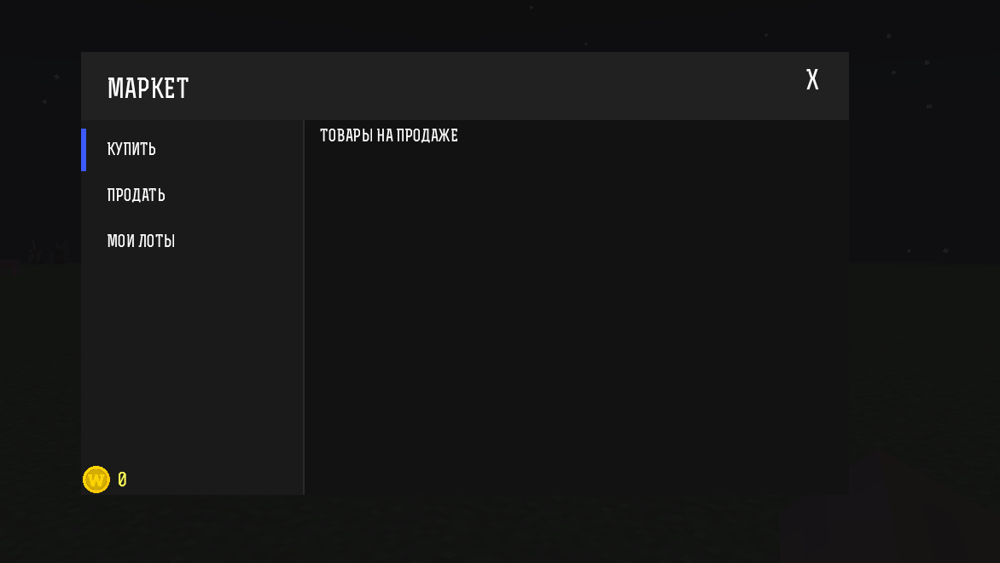  

  


---

### ⚙️ [GUI/Клиент] CustomTooltips (1.7.10)  
Измененное отображение информации об предмете.

**Скриншоты:**  
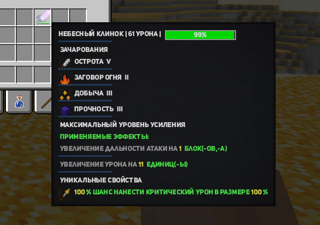  
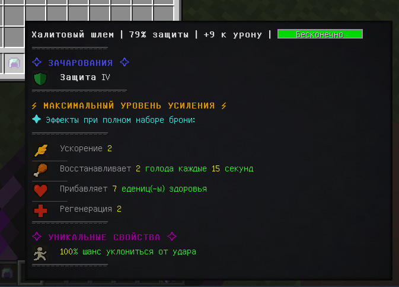

---

### ⚙️ [GUI/Клиент] CustomInventory (1.7.10)  
Измененный инвентарь игрока и горячие слоты(хотбары).
В данной реализации, в новые 4 слота можно положить определенные артефакты с эффектами.

**Скриншоты:**  
  


---

### 📩 [GUI/Клиент] TabMod (1.11.2)  
Измененное отображение информации об количестве игроков.

**Скриншоты:**  
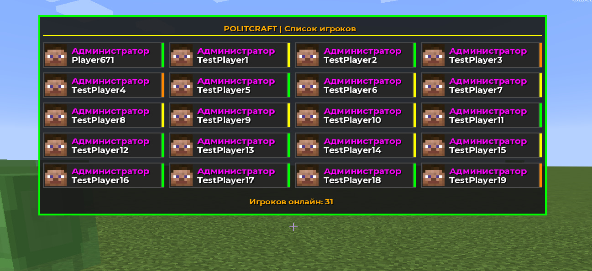  

---

### 📩 [GUI/Клиент] CustomMainMenu (1.20.1)  
Измененное главное меню и выбор сервера.  
**Скриншоты:**  

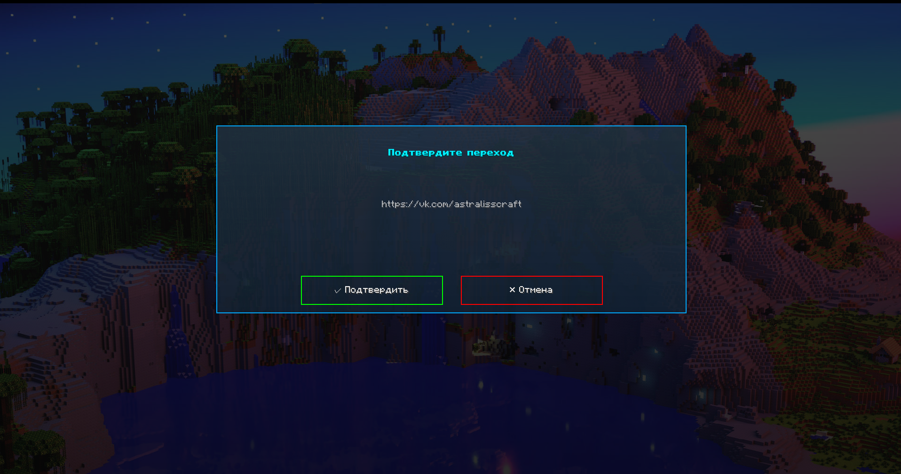  


---

## 🚧 В Разработке
- 🛍️ Магазин (GUI)
- 🛡️ AdminSystem (бан/кик/просмотр инвентаря и тд.)

---

## 📬 Связь
[](https://t.me/jinwosss)
